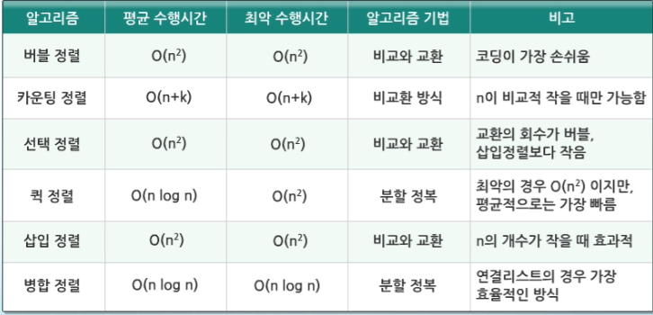

# 1. Algorithm

## 개요
* 유한한 단계를 통하여 문제를 해결하기 위한 절차 or 방법
* 슈도코드나 순서도로 표현

## 성능분석
* 정확성, 작업량, 메모리 사용량, 단순성, 최적성 등으로 성능 판단
* 작업량을 표현할 때 시간복잡도 이용

# 2. Array
## Array 특성
* 일정한 자료형의 변수들을 하나의 이름으로 열거하여 사용하는 자료구조

## Array 필요성
* 프로그램 내에서 여러 개의 변수가 필요할 때, 일일이 다른 변수명을 이용하여 자료에 접근하는 것은 매우 비효율적
* 다수의 변수로는 하기 힘든 작업을 Array를 활용해 쉽게 할 수 있다.

# 3. Exhaustive Search(브루트 포스)
* 문제의 해법으로 생각할 수 있는 모든 경우의 수를 나열해보고 확인하는 기법
* 모든 경우의 수를 테스트한 후, 최종 해법을 도출

# 4. Greedy Algrorithm(탐욕 알고리즘)
* 여러 경우 중 하나를 결정해야 할 때마다 그 순간에 최적이라고 생각되는 것을 선택해 나가는 방식으로 진행하여 최종적인 해답에 도달한다.
* 각 선택의 시점에서 이루어지는 결정은 지역적으로는 최적이지만, 그 선택들을 계속 수집하여 최정적인 해답을 만들었다고 하여, 그것이 최적이라는 보장은 없다.

# 5. SORT

## Bubble Sort
* 인접한 두 개의 원소를 비교하며 자리를 계속 교환하는 방식
* 시간복잡도 O(n^2)

## Counting Sort
* 항목들의 순서를 결정하기 위해 집합에 각 항목이 몇 개씩 있는지 세는 작업을 하여, 선형 시간에 정렬하는 효율적인 알고리즘.
* 시간 복잡도 O(n+k): n은 항목의 개수, k는 정수의 최대값
* [그림예제](http://bowbowbow.tistory.com/8)
* [예제](http://nhs0912.tistory.com/57)

	

